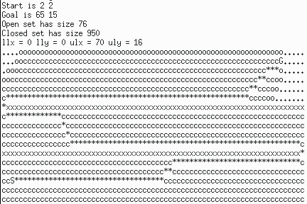
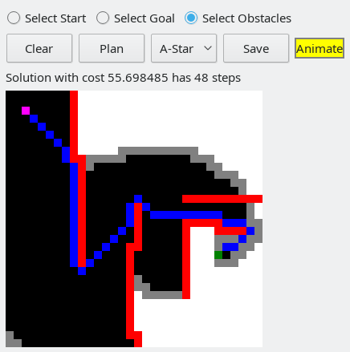
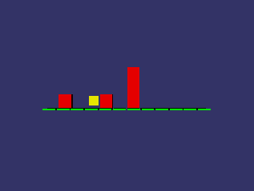

# Gras

<p float="center">
  
</p>

Gras is a C++ library that implements the standard search algorithms A*, 
Dijkstra and Greedy search. A lot of other libraries do this as well.
Here is what makes Gras unique:

- Operates on implicit graphs that are unknown at the start of the search, 
  and are expanded step-by-step throughout the search process
- Arbitrary dimensions: From grid worlds to whatever dimension you need
- Intuitive and easy to use: Problem-specifics are hadnled in a single class, 
  independent of any search-related code
- Pretty fast
- Compiles for standards < C++11
- No dependencies for the Gras library (Just for the examples)
- Tested on Ubuntu 14.04, 18.04 and Visual Studio 2017

## Download and build

Here is how you download and build Gras:

```
me@computer: > git clone https://github.com/HRI-EU/Gras.git
me@computer: > cd Gras
me@computer: > mkdir build
me@computer: > cd build
me@computer: > cmake ..
me@computer: > make
```

## Examples

<p float="left">
 
 
 
</p>

The library comes with three examples. The example **ExampleGrid** depends on 
the Qt library and will only be built if Qt is installed. The example
**ExampleMonkey** depends on the OpenSceneGraph library, the same applies here.
Both the Qt and OpenSceneGraph dev-packages can be installed from the Ubuntu 
default package repositories. To run the examples, just type:

```
me@computer: > ./ExampleConsole
me@computer: > ./ExampleGrid
me@computer: > ./ExampleMonkey
```
The **ExampleConsole** performs a 2d grid search on a maze with pre-defined 
obstacles. The **ExampleGrid** is also illustrating a grid search, and allows
the user to specify start, goal and obstacles in a Qt Gui. The **ExampleMonkey**
is inspired by Koehler's famous monkey experiment. A monkey has to stack a set
of boxes on top of each other in order to reach a banana. The state dimension is
the number of possible box positions, and the state value is the height of the
box stack on the corresponding box location. 

## Todo
  
  - Implement metric of spread
  - Sample consistency and monotony
  - Add references & links
  - Add explanations
  - Fix manually calling event updates in blocking callback function
  - Tie-breaking
  - Add timing stats to examples
